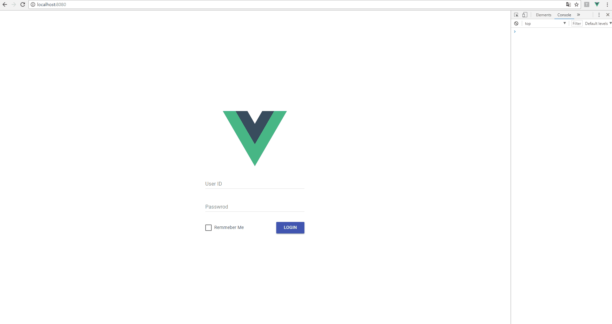

# iron

> A Vue.js project

## Build Setup

``` bash
# install dependencies
npm install

# serve with hot reload at localhost:8080
npm run dev

# build for production with minification
npm run build

# build for production and view the bundle analyzer report
npm run build --report

# run unit tests
npm run unit

# run e2e tests
npm run e2e

# run all tests
npm test
```

For detailed explanation on how things work, checkout the [guide](http://vuejs-templates.github.io/webpack/) and [docs for vue-loader](http://vuejs.github.io/vue-loader).
***


## Use npm package
> vue-cli webpack  
axios   
chart.js  
es6-promise  
moment  
vue-chartjs  
vue-material  
vuedraggable  
vuejs-datepicker  

## screenshot
-
-
